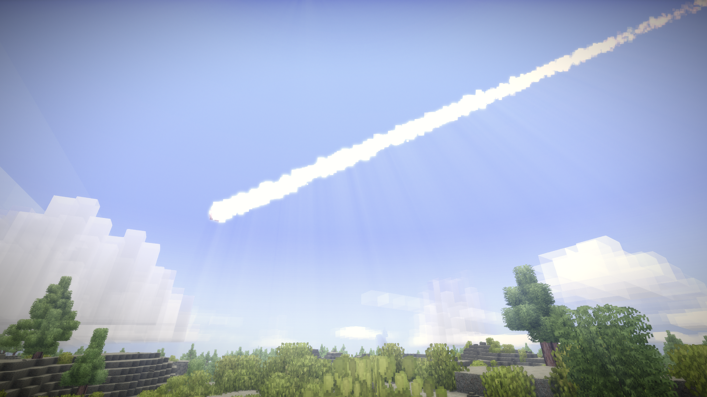

## Meteoric Expansion

The skies burn with balls of fire barrelling towards the planet at cosmic speeds....Is this the apocalypse?

### Description

Hello, welcome to the mod repository for the Vintage Story mod, Meteoric Expansion!

This mod aims to bring the cosmos to Vintage Story in a very literal sense. In vanilla Vintage Story it's possible to stumble across small surface deposits of meteoric iron...but where did it come from? Meteors don't exist in vanilla!
Meteoric Expansion fills this space. This mod will spawn occasional randomized meteors that will streak through the skies, burning up or exploding like a real meteor would. There's also a small chance that they'll crash to the ground, depositing their riches into the world...!

### IMPORTANT

Meteoric Expansion ships with configurable options! 

By default meteors are NOT destructive and will NOT damage the world or player structures. With the destructive option set to false Meteoric Expansion is purely cosmetic. 
Your world and structures may be safe...but you also won't be able to gather the goodies that a meteorite would deposit. Risk vs reward...  

To change your config, load up a game with the mod installed and enabled. After the mod runs once, a MeteoricExpansionConfig.json file will be available for edit in...
'C:\Users\{Your Username}\AppData\Roaming\VintagestoryData\ModConfig'

Exit to menu, edit this file, then load your save to see the changes!

Further config details can be found by opening the mod ZIP and reading the readme in 'assets\meteoricexpansion\config\'.

### Releases

### Vintage Story 1.16.0+
[Version 1.0.6](https://github.com/TaskaRaine/Meteoric-Expansion/releases/download/1.0.6/MeteoricExpansion_v1.0.6.zip)

### Vintage Story 1.15.0+
[Version 1.0.5](https://github.com/TaskaRaine/Meteoric-Expansion/releases/download/1.0.5/MeteoricExpansion_v1.0.5.zip)

### Vintage Story 1.14.0+
[Version 1.0.4](https://github.com/TaskaRaine/Meteoric-Expansion/releases/download/1.0.4/MeteoricExpansion_v1.0.4.zip)

[Version 1.0.3](https://github.com/TaskaRaine/Meteoric-Expansion/releases/download/1.0.3/MeteoricExpansion_v1.0.3.zip)

[Version 1.0.2](https://github.com/TaskaRaine/Meteoric-Expansion/releases/download/1.0.2/MeteoricExpansion_v1.0.2.zip)

[Version 1.0.1](https://github.com/TaskaRaine/Meteoric-Expansion/releases/download/1.0.1/MeteoricExpansion_v1.0.1.zip)

[Version 1.0.0](https://github.com/TaskaRaine/Meteoric-Expansion/releases/download/1.0.0/MeteoricExpansion_v1.0.0.zip)

### Changelog

##### Version 1.1.0
Meteors are now made of their own unique blocks. 'Cracked Meteoric Stone'.

'Cracked Meteoric Stone' has multiple variants. Smouldering, and cooled. Smouldering stone produces smoke plumes and damages creatures that step on it. Smouldering stone will cool over time.

A new config setting has been added. If 'ClaimsProtected' is set to true, this will ensure that, if the Destructive config is enabled...claims will not be harmed by falling meteors. 

Traces of ash can be found in craters. Ash can be used as a fertilizer as it's high in phosphorus and nitrogen.

Compatibility for More Metals and Fahl Ores has been implemented.

Only useful meteors are now implemented into the vanilla version. No more overwhelming amounts of uranium.

Gold and silver now can appear in meteors.

Rock can be heated in a fire pit and 'cooked' into a cracked smouldering version.

##### Version 1.0.6
Compatability patch for Vintage Story 1.16

##### Version 1.0.5
Compatability patch for Vintage Story 1.15

##### Version 1.0.4
Fixed a crash related to particles.

Made all meteor sounds be activated server-side to be heard at great distances.

Sounds are now directional and volume changes based on distance. 

New meteor streaking sound, dynamically mixed and played server-side.

Added more depth to the explosion sounds.

##### Version 1.0.3
Fixed a client crash resulting from clients trying to access config data on meteor spawn.

Increased the volume of meteor sizzles and meteor explosions.

##### Version 1.0.2
Added config options to allow configuration of meteor spawn distances from the player.

Removed unused code that caused a warning in the client error log.

##### Version 1.0.1
Removed Rhodocrosite and Pentlandite as possible meteor minerals. There's no current use for them in vanilla Vintage Story.

Gave meteors names that better describe their composition.

Fixed an issue where meteor names would appear as code strings in the handbook(thank you, lisabet, for pointing this out to me).

##### Version 1.0.0
Initial Release
